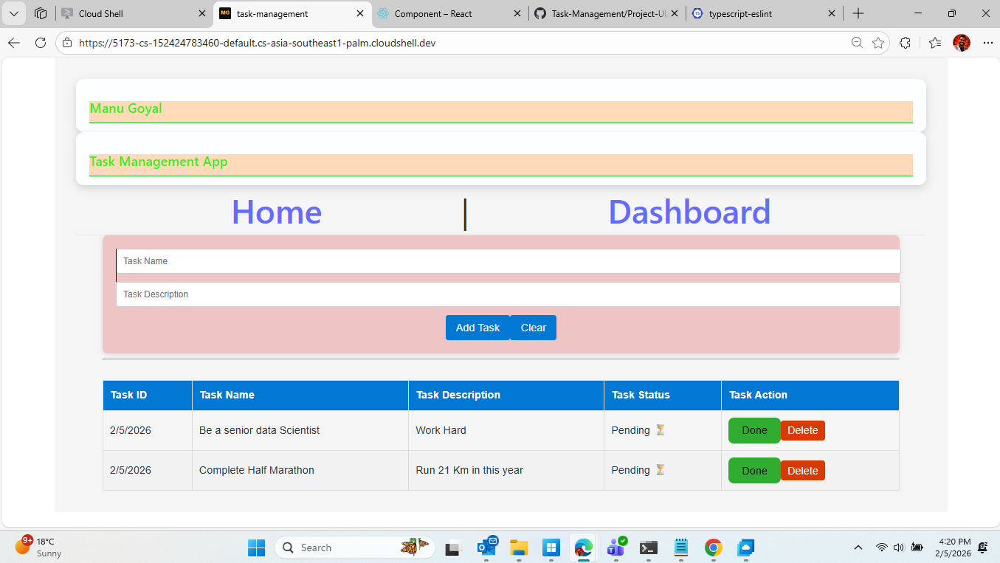

# Task Management Dashboard



## Project Overview
This is a **learning project** from my company training program. The project is a **Task Management Dashboard** built using **React**, **React Router**, and **Chart.js**. The goal was to practice building a dynamic front-end application, handling state management, and creating reusable UI components.

---

## Features
- Add, view, and track tasks
- Dashboard with pie chart showing **Done** vs **Pending** tasks
- Responsive layout with cards and shadow effects
- One-time welcome page (Manu Goyal page) before accessing main app
- Navigation between **Home** and **Dashboard**
- LocalStorage integration for persisting tasks across sessions

---

## Learning Outcomes
During this project, I learned and practiced:
- Building reusable React components
- Using **React Router** for navigation and conditional redirects
- Handling **state management** across multiple pages
- Using **Chart.js** to display dynamic data in pie charts
- Styling with CSS and creating responsive layouts
- Using **localStorage** to store and retrieve persistent data
- Conditional rendering and building UI with **cards and shadows**
- Best practices for React project structure

---

## Achievements
- Successfully implemented a functional **dashboard with stats**  
- Integrated **charts** with dynamic task data  
- Built a **single-page app experience** with multiple navigations  
- Learned to make **components reusable and maintainable**  
- Understood **state persistence** across pages using localStorage  

---

## Author
[LinkedIn Profile](https://www.linkedin.com/in/manu-goyal007/)  

---

## How to Run
1. Clone the repository:  
   ```bash
   git clone https://github.com/manu-goyal007/Task-Management.git
2. NAvigate to project folder:
   ```bash 
   cd /Task-Management/Project-UI/task-management
3. Install dependencies
    ```bash 
    npm install
4. For Dev and editing 
    ```bash 
    npm run dev
5. Start the server
    ```
    npm start
